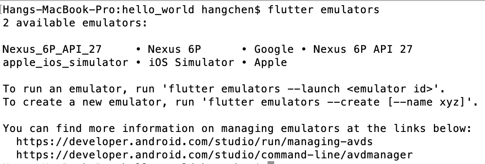
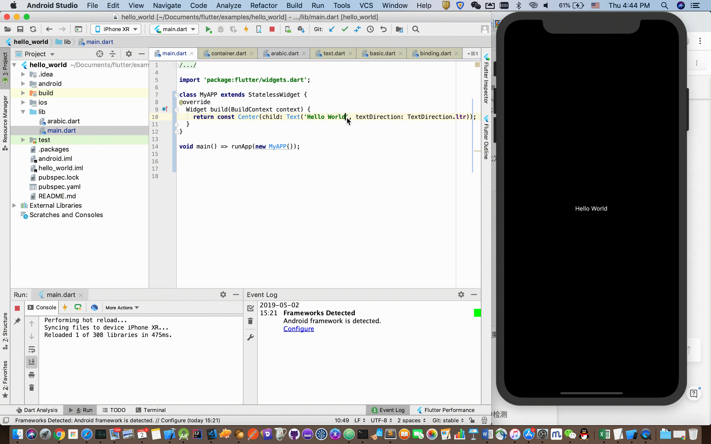

俗话说，工欲善其事，必先利其器。任何一门新技术、新语言的学习，都需要从最基础的工程环境搭建开始，学习 Flutter 也不例外。所以，作为专栏的第一篇文章，我会与你逐一介绍 Flutter 的开发环境配置，并通过一个 Demo 为你演示 Flutter 项目是如何运行在 Andorid 和 iOS 的模拟器和真机上的。如果你已经掌握了这部分内容，那可以跳过这篇预习文章，直接开始后面内容的学习。

由于是跨平台开发，所以为了方便调试，你需要一个可以支持 Android 和 iOS 运行的操作系统，也就是 macOS，因此后面的内容主要针对的是在 macOS 系统下如何配置 Flutter 开发环境。

如果你身边没有 macOS 系统的电脑也没关系，在 Windows 或 Linux 系统上配置 Flutter 也是类似的方法，一些关键的区别我也会重点说明。但这样的话，你就只能在 Android 单平台上开发调试了。

# 准备工作
## 安装 Android Studio
Android Studio 是基于 IntelliJ IDEA 的、Google 官方的 Android 应用集成开发环境 (IDE)。

我们在[官网](https://developer.android.com/studio/index.html?hl=zh-cn)上找到最新版（截止至本文定稿，最新版为 3.4），下载后启动安装文件，剩下的就是按照系统提示进行 SDK 的安装和工程配置工作了。

配置完成后，我们打开 AVD Manager，点击“Create Virtual Device”按钮创建一台 Nexus 6P 模拟器，至此 Android Studio 的安装配置工作就完成了。

## 安装 Xcode
Xcode 是苹果公司官方的 iOS 和 macOS 应用集成开发环境 (IDE)。它的安装方式非常简单，直接在 macOS 系统的 App Store 搜索 Xcode，然后安装即可。

安装完成后，我们会在 Launchpad 看到 Xcode 图标，打开它，按照提示接受 Xcode 许可协议，以及安装配置组件就可以了。

配置完成后，我们打开 Terminal，输入命令 open -a Simulator 打开 iOS 模拟器，检查 Hardware>Device 菜单项中的设置，并试着在不同的模拟器之间做切换。

至此，Xcode 的安装配置工作也就顺利完成了。

## 安装 Flutter
Flutter 源站在国内可能不太稳定，因此谷歌中国开发者社区（GDG）专门搭建了临时镜像，使得我们的 Flutter 命令行工具可以到该镜像站点下载所需资源。

接下来，我们需要配置镜像站点的环境变量。对于 macOS 和 Linux 系统来说，我们通过文本编辑器，打开~/.bash_profile 文件，在文件最后添加以下代码，来配置镜像站点的环境变量：

``` bash
export PUB_HOSTED_URL=https://pub.flutter-io.cn
export FLUTTER_STORAGE_BASE_URL=https://storage.flutter-io.cn
```
而对于 Windows 系统来说，我们右键点击计算机图标，依次选择属性–> 高级系统设置–> 高级–> 环境变量，新建用户变量 PUB_HOSTED_URL，其值为https://pub.flutter-io.cn；随后新建 FLUTTER_STORAGE_BASE_URL，其值为https://storage.flutter-io.cn，重启电脑即可完成配置。

**到这里，我们就完成了镜像的配置**。

不过，由于 GDG 并不是官方组织，因此 Flutter 团队也无法保证此服务长期可用。但是，你也不用担心，可以关注 Flutter 社区 Using Flutter in China，来获取其他可用的镜像资源，随时更新环境变量即可。

随后，我们再去[Flutter 官网](https://flutter.dev/docs/development/tools/sdk/releases?tab=macos)，选择并下载最新的稳定版（截止至本文定稿，最新稳定版为 1.5）。

接下来，我们把下载的压缩包解压到你想安装的目录，比如~/Documents 或 C:\src\flutter。为了可以在命令行中执行 flutter 命令，我们同样需要配置环境变量。

对于 macOS 与 Linux 系统，我们编辑~/.bash_profile 文件，把以下代码添加至文件最后，将 flutter 命令的执行路径追加到环境变量 PATH 中：

``` bash
export PATH=~/Documents/flutter/bin:$PATH
```
而对于 Windows 系统，我们在当前用户变量下 Path，以 ; 为分隔符，在其后追加 flutter 命令行的全路径 C:\src\flutter\bin，重启电脑即可完成配置。

**到这里，我们就完成了 Flutter SDK 的安装**。

打开 Flutter 根目录，我们可以发现有一个 examples 文件夹，里面是一些基本的 flutter 示例。在今天这篇文章中，我会以 hello_world 示例为例，和你演示一下**如何在模拟器和真机中运行 Flutter 项目**。

首先，我给你介绍的是通过 Flutter 命令行运行的模式。进入 hello_world 目录，输入 `flutter emulators` 命令，查看当前可用的模拟器：


可以看到，我们刚刚创建的两台模拟器，也就是 Nexus 6P 和 iOS 模拟器都已经在列表中了。于是，我们启动 iOS 模拟器，运行 Flutter 项目：
``` bash
flutter emulators --launch apple_ios_simulator
flutter run
```
等待 10 秒左右，一个熟悉的 hello world 大屏幕就出现在我们面前了：


Android 模拟器的启动和运行，也与之类似，我就不再赘述了。

不过，使用命令行的方式来开发调试 Flutter 还是非常不方便，**更高效的方式是配置 Android 和 iOS 的集成开发环境**。

Flutter 提供了一个命令 `flutter doctor` 协助我们安装 Flutter 的工程依赖，它会检查本地是否有 Android 和 iOS 的开发环境，如果检测到依赖缺失，就会给出对应依赖的安装方法。

接下来，我们试着运行下 flutter doctor 这条命令，得到了如下图所示的结果：


可以看到，flutter doctor 检测出了 iOS 工具链、Android Studio 工程这两项配置中的问题。此外，由于我的电脑还安装了 IDEA 和 VS Code，而它们也是 Flutter 官方支持的 IDE，因此也一并检测出了问题。

接下来，我们根据运行 flutter doctor 命令得到的提示，来分别解决 iOS 工具链和 Android Studio 工程配置问题。

## iOS 工具链设置
现在，我们已经可以在 iOS 模拟器上开发调试 Flutter 应用了。但要将 Flutter 应用部署到真实的 iOS 设备上，我们还需要安装一些额外的连接控制命令工具（就像通过电脑的 iTunes 给手机安装应用一样），并申请一个 iOS 开发者账号进行 Xcode 签名配置。

依据提示，我们**首先**安装 libimobiledevice 和 ideviceinstaller 这两项依赖：
``` bash
brew update
brew install --HEAD usbmuxd
brew link usbmuxd
brew install --HEAD libimobiledevice
brew install ideviceinstaller
```
其中，usbmuxd 是一个与 iOS 设备建立多路通信连接的 socket 守护进程，通过它，可以将 USB 通信抽象为 TCP 通信；libimobiledevice 是一个与 iOS 设备进行通信的跨平台协议库；而 ideviceinstaller 则是一个使用它们在 iOS 设备上管理 App 的工具。

现在，你不了解它们的具体作用也没关系，只要知道安装了它们，Flutter 就可以进行 iOS 真机的开发调试就可以了。

**然后**，进行 Xcode 签名配置。

打开 hello_world 项目中的 ios/Runner.xcworkspace，在 Xcode 中，选择导航面板左侧最上方的 Runner 项目。


在 **General** > **Signing** > **Team** 中，我们需要配置一下开发团队，也就是用你的 Apple ID 登录 Xcode。当配置完成时，Xcode 会自动创建并下载开发证书。

任意 Apple ID 都支持开发和测试，但如果想将应用发布到 App Store，则必须加入 Apple 开发者计划。开发者计划的详细信息，你可以通过苹果官方的[compare memberships](https://developer.apple.com/support/compare-memberships/)了解，这里我就不再展开了。

**最后**，当我们第一次连接真机设备进行开发时，Xcode 会在你的帐户中自动注册这个设备，随后自动创建和下载配置文件。我们只需要在真机设备上，按照手机提示，信任你的 Mac 和开发证书就可以了。

至此，我们就可以在 iOS 真机上开发调试 Flutter 项目了。

## Android 工具链配置

相对于 iOS 工具链的设置，Android 工具链配置就简单多了，这是因为 Google 官方已经在 Android Studio 中提供了 Flutter 和 Dart 这两个插件。因此，我们可以通过这两个工程插件，进行 Flutter 项目的管理以及开发调试。又因为 Flutter 插件本身依赖于 Dart 插件，所以我们只安装 Flutter 插件就可以了。


启动 Android Studio，打开菜单项 **Preferences > Plugins**，搜索 Flutter 插件并点击 install 进行安装。安装完毕后重启 Android Studio，Flutter 插件就生效了。

由于 Android Studio 本身是基于 IDEA 开发的，因此 IDEA 的环境配置与 Android Studio 并无不同，这里就不再赘述了。

对于 VS Code，我们点击 View->Command Palette，输入"install"，然后选择"Extensions：Install Extension"。在搜索框中输入 flutter，选择安装即可。

至此，Android 的工具链配置也完成了。

尽管 Android Studio 是 Google 官方的 Android 集成开发环境，但借助于 Flutter 插件的支持，Android Studio 也因此具备了提供一整套 Flutter 开发、测试、集成打包等跨平台开发环境的能力，而插件底层通过调用 Xcode 提供的命令行工具，可以同时支持开发调试及部署 iOS 和 Android 应用。

因此，**我后续的分享都会以 Android Studio 作为讲解 Flutter 开发测试的 IDE**。

## 运行 Flutter 项目

用 Android Studio 打开 hello_world 工程（Open an existing Android Studio Project），然后定位到工具栏：


在 Target selector 中，我们可以选择一个运行该应用的设备。如果没有列出可用设备，你可以采用下面的两种方式：
- 参考我在前面讲到的方法，也就是打开 AVD Manager 并创建一台 Android 模拟器；或是通过 open -a Simulator 命令，在不同的 iOS 模拟器之间进行切换。
- 直接插入 Android 或 iOS 真机。

hello_world 工程稍微有点特殊，因为它提供了两个 Dart 启动入口：一个英文版的 hello world-main.dart，和一个阿拉伯语版的 hello world-arabic.dart。因此，我们可以在 Config selector 中进行启动入口的选择，也可以直接使用默认的 main.dart。

在工具栏中点击 Run 图标，稍等 10 秒钟左右，就可以在模拟器或真机上看到启动的应用程序了。

对于 Flutter 开发测试，如果每次修改代码都需要重新编译加载的话，那需要等待少则数十秒多则几分钟的时间才能查看样式效果，无疑是非常低效的。

正是因为 Flutter 在开发阶段使用了 JIT 编译模式，使得通过热重载（Hot Reload）这样的技术去进一步提升调试效率成为可能。简单来说，热重载就是在无需重新编译代码、重启应用程序、丢失程序执行状态的情况下，就能实时加载修改后的代码，查看改动效果。

> 备注：我会在“02 | 预习篇 · Dart 语言概览”中，与你分析 Flutter 使用 Dart 语言，同时支持 AOT 和 JIT。

就 hello_world 示例而言，为了体验热重载，我们还需要对代码做一些改造，将其根节点修改为 StatelessWidget：

``` dart
import 'package:flutter/widgets.dart';
class MyAPP extends StatelessWidget {
  @override
  Widget build(BuildContext context) {
    return const Center(child: Text('Hello World', textDirection: TextDirection.ltr));
  }
}
void main() => runApp(new MyAPP());
```
点击 Run 图标，然后试着修改一下代码，保存后仅需几百毫秒就可以看到最新的显示效果。


是不是很 Cool！但是，**热重载也有一定的局限性，并不是所有的代码改动都可以通过热重载来更新**。

对 hello_world 示例而言，由于 Flutter 并不会在热重载后重新执行 main 函数，而只会根据原来的根节点重新创建控件树，因此我们刚才做了一些改造之后才支持热重载。

关于 Flutter 热重载的原理以及限制原因，我会在后面“34 | Hot Reload 是怎么做到的？”文章，和你详细分析。现在，你只需要知道，如果热重载不起作用的时候，我们也不需要进行漫长的重新编译加载等待，只要点击位于工程面板左下角的热重启（Hot Restart）按钮就可以以秒级的速度进行代码重编译以及程序重启了，而它与热重载的区别只是因为重启丢失了当前程序的运行状态而已，对实际调试也没什么影响。
